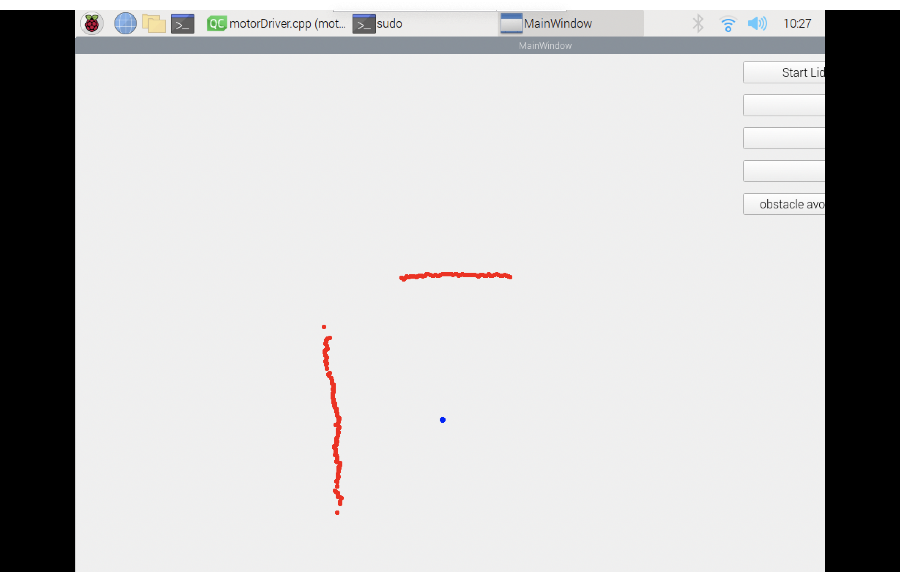

# Slamtec RPLIDAR C1 with a Raspberry PI

The following shows how to initialize the radar and read information about surrounding obstacles through the radar's own USB interface and the official SDK. At the same time, it also introduces how to use QT to draw the obstacle information scanned by the radar on the screen, and to achieve dynamic path generation to reach the target point over the obstacles by combining the UWB module and A* algorithm.

## RPLIDAR C1 Control Class

### Connect to radar and initialize
Instantiate the radar object lidar, and instantiate the serial port channel class sl::IChannel, and establish a connection with the radar through the function lidar->connect(channel). Since RPLidar C1 needs to start the motor in advance, use the function setMotorSpeed() to complete the corresponding operation.
### Read data and process
Create the array sl_lidar_response_measurement_node_hq_t nodes[8192] to store the position information of obstacles read by the radar. The function grabScanDataHq(nodes, count, 0) usually reads the data in a circle around the radar (about 510) and saves it to the nodes array. , since the points read by the grabScanDataHq function are out of order rather than increasing sequentially according to the angle, the function ascendScanData(nodes, count) is needed to sort the points so that they keep the angle increasing sequentially. The member variables of the structure sl_lidar_response_measurement_node_hq_t are sequentially They are angle_z_q14, dist_mm_q2, and quality respectively represent the angle, distance and quality of the current point. Since what we get are coordinates in the polar coordinate system, we also need to convert the current polar coordinates into the corresponding Cartesian coordinates in subsequent use.
### Stop radar
Use the function lidar->stop() to stop the radar and stop scanning obstacle points. Since RPLidar C1 needs to manually turn on and off the drive motor, call the function lidar->setMotorSpeed(0) to stop the radar motor.

## Use QT to draw obstacle points
### Signal and Slots
Signals and slots are Qt's unique information transmission mechanism and an important basis for designing Qt programs. They allow objects that do not interfere with each other to establish a connection. When a signal is sent, the connected slot function will be automatically called back. This is similar to the observer pattern: when an event of interest occurs, an operation will be automatically triggered.In this program, we use buttons to connect click actions and drawing functions to realize the graphical interface representation of radar obstacles.
### Draw obstacle points

Since the obstacle information obtained by the radar is in polar coordinates, we first need to convert it to the corresponding Cartesian coordinates and convert the coordinate system. In this program, we use the (500, 500) point of the screen as the initial point of the radar. Click to draw subsequent obstacle information.

## Combine UBW module and A* algorithm to generate dynamic paths

### UWB module
In this program, we can use the UWB module to get the tag's current clamping feet and distance based on the base station, and use these two data to achieve subsequent car following and dynamic path generation.
### A* algorithm
The A* (A-Star) algorithm is a commonly used pathfinding algorithm, used to find the shortest path from the starting point to the target point in a graphical environment.
The cost function 𝑓(𝑛) consists of two parts: the cost 𝑔(𝑛) from the starting point to the current node along the generated path and the estimated cost ℎ(𝑛) from the current node to the end point. Formula expression: 𝑓(𝑛) = 𝑔(𝑛) + ℎ(𝑛)
h = abs(end_node(1) - openlist(i,1))+abs(end_node(2) - openlist(i,2));
open list: a grid that records all the cells considered to find the shortest path
closed list: a grid whose records will no longer be considered
### Generate dynamic paths

We set the initial point to (50, 70), the stop point to the Cartesian coordinates after processing the data obtained by the UWB module, and set the processed data obtained from the radar to the obstacle point of A*, start the A* algorithm, and obtain the generated path A list of coordinate points and drawn in real time through QT (A* coordinates are scaled according to a 1:10 scale).
