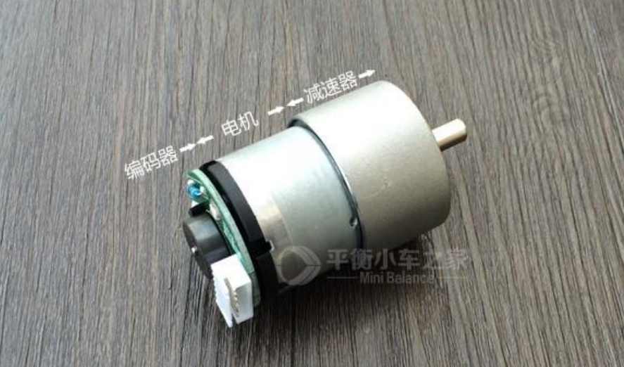

1. **Motors**
   - Use two 12V high-power DC reduction motors with built-in Hall encoders to control the direction of the cart.

2. **Motor Driver**

   - The motors are driven by a TB6612 driver board, which includes a voltage regulator circuit. It can supply 12V to the motors while providing 5V to the Raspberry Pi. It accepts PWM wave inputs and direction signals to control the motors and transmits encoder signals to the Raspberry Pi.
   - Connection details of control pins:
     - Raspberry Pi pin | Raspberry Pi GPIO | TB6612/(MOTOR)
     - 2 | 5V
     - 6 | Ground
     - 13 | GPIO27 | PWMB (Motor1 speed control)
     - 15 | GPIO22 | PWMA (Motor2 speed control)
     - 29 | GPIO5 | AIN1 (Motor1 rotate direction control)
     - 31 | GPIO6 | AIN2
     - 16 | GPIO23 | BIN1 (Motor2 rotate direction control)
     - 18 | GPIO24 | BIN2
     - 32 | GPIO12 | EA2 (Motor2 A phase)
     - 36 | GPIO16 | EB2 (Motor2 B phase)
     - 38 | GPIO20 | EA1 (Motor1 A phase)
     - 40 | GPIO21 | EB1 (Motor1 B phase)

3. **PWM Generation**
   - Utilize the pigpio library to output PWM control using GPIO22 (left wheel) and GPIO27 (right wheel), with a frequency of 10,000 kHz.

4. **Using Encoders for Speed Loop Control**
   - Employ the pigpio library to capture the A and B directional encoder signals from both motors, counting the rising edges with callback functions callbackL and callbackR to accumulate counts. These counts are periodically sampled by timer0, stored into vLcurrent and vRcurrent, then cleared for recounting. The sampled vLcurrent and vRcurrent are used for feedback adjustment based on the target speed using a PID algorithm to correct the speed and adjust PWM output, completing the speed loop.
   - Use the professor's encoder class, with two instances to capture the encoding signals from both motors.

5. **Accurate Angle and Displacement Control**
   - Inside timer0, based on the target change in angle or displacement, accumulate the total count value target_count. The relationship between count values and actual angles and displacements is determined by formulas derived from practical measurement data:
     - `Target_count = distance * 18`
     - `Target_count = (angle * 10 / 3) + 0.004 * angle * angle`
   - Upon reaching the total count value, control the PWM to stop the cart and notify the data sending function via a condition function to signal command completion.
